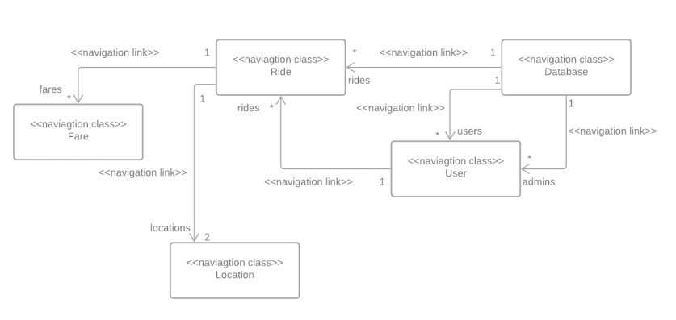

# Demo

See demo here ---> [Farebear](https://farebear.netlify.app/)

## Introduction

A price comparison software is a website that allows you to know, always, what prices are
applied by different riding apps to allow user select wisely between different services
provided and make an optimal decision as per their choice.

### 6th semester project

A group project developed by
* [Maida Afzal](https://github.com/maidaNsiddique)
* [Quratulain Aisha](https://github.com/QuratulAinAisha)

### Navigation Diagram

#### Testing from windows 